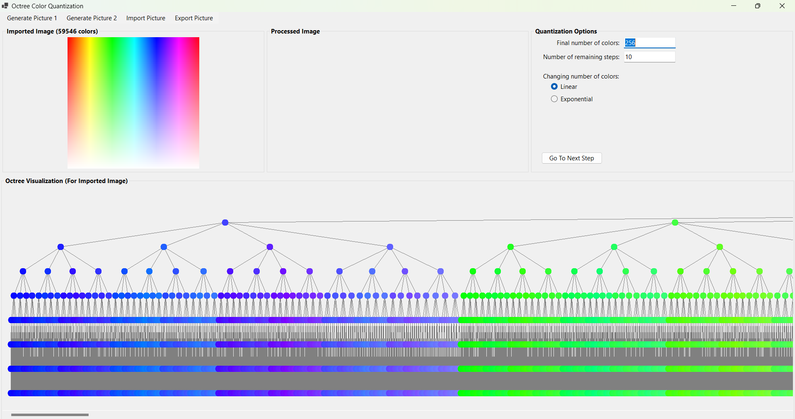
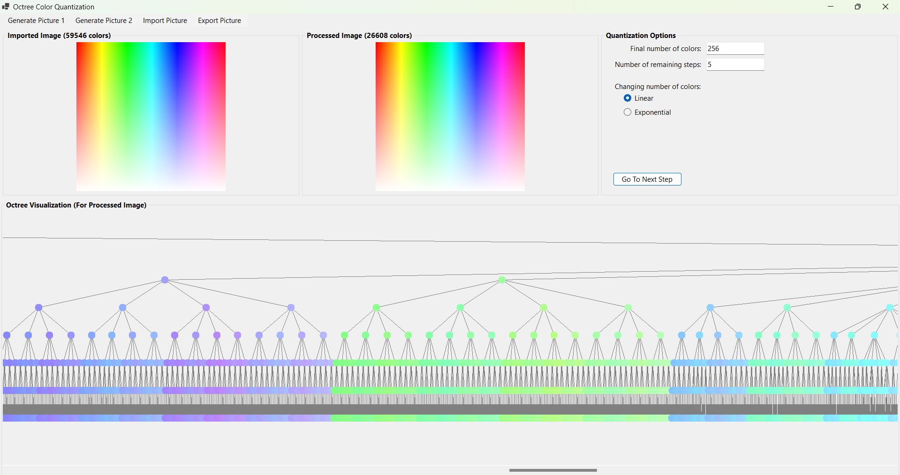
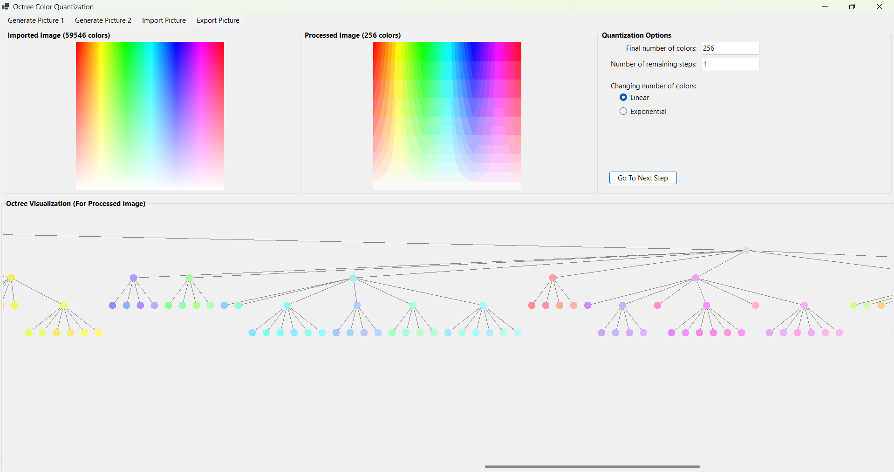
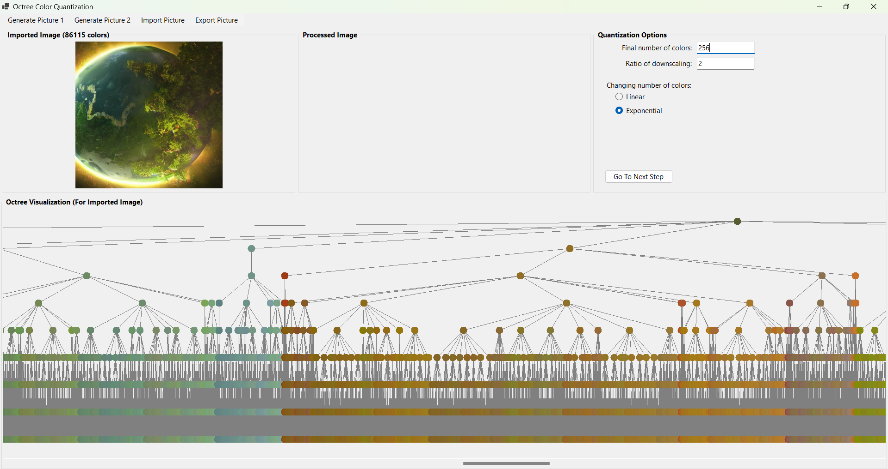
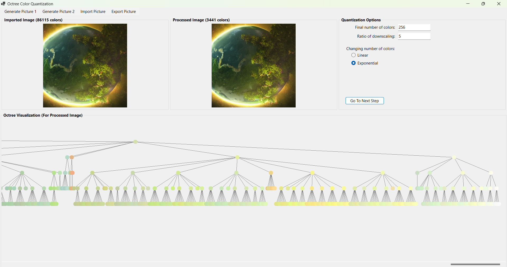
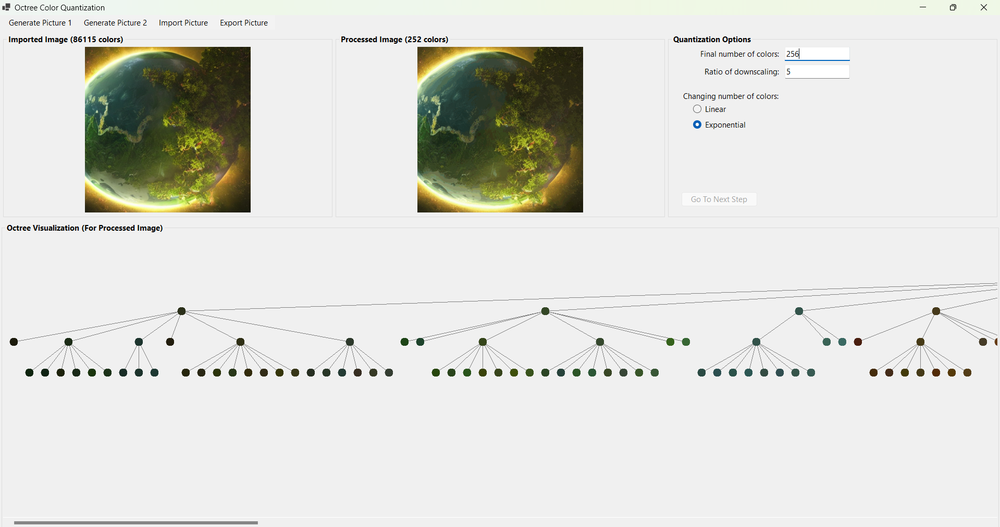
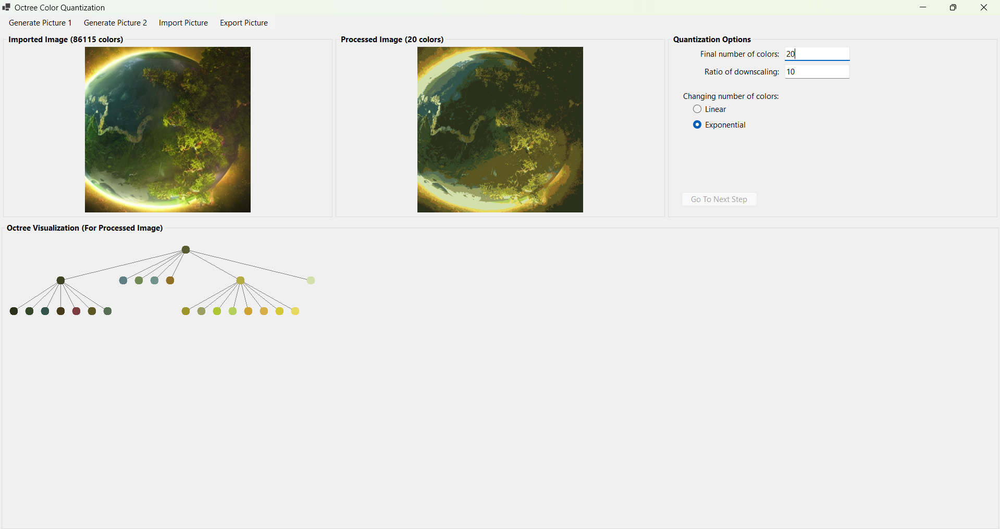

## Image processing app - Octree Color Quantization

## General description
It is a desktop application created with Windows Forms from .NET environment. Its functionality is to create an octree from imported image and use it to have a number of colors in exported image reduced. Thanks to that model of lossy compression, we can decrease the size of a data file with quite slight loss of quality.

## Octree
Octrees seems to be a very efficient data structure. They are like binary trees but each node can have 8 subnodes instead of 2. Searching and inserting into such an octree is very fast. In case of having 8-bit color components it is possible to easily choose the child node according to bit on particular position in all 3 components. More details about them can be found there: https://www.cubic.org/docs/octree.htm.

## Menu options
- [ ] Generate Picture (1, 2) - load one of default images as imported image
- [ ] Import Image - load imported image from image file (.bmp, .jpg, .png)
- [ ] Export Image - save processed image into image file (.bmp, .jpg, .png)

## Quantization Options
- [ ] Linear - you can set final number of colors and number of remaining steps
- [ ] Exponential - you can set final number of colors and ratio of downscaling

## Octree Visualization
Being located on the bottom of the window, is updated on each step of quantization. Due to the fact that the octree can be very wide, you can scroll it horizontally.

## Images

### Image for processing generated with option: "Generate Picture 2":

### Image for processing imported from file:

